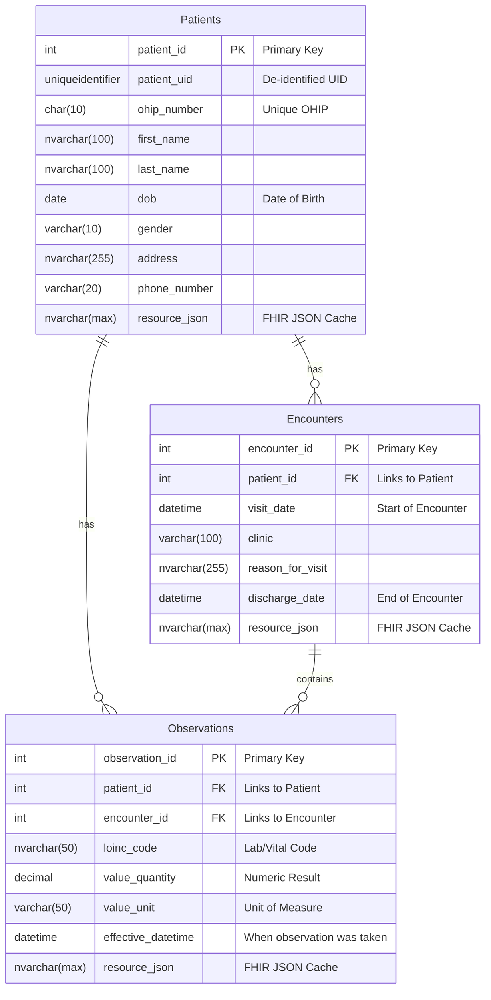

# LHSCDB: Database Schema and Architecture

This document provides a comprehensive overview of the `LHSCDB` SQL Server database. It serves as the internal, private "source-of-truth" for the custom `LhscFhirServer` application.

---

## 🎯 Purpose

The `LHSCDB` is designed to simulate a real-world hospital's legacy Electronic Health Record (EHR) database. It stores sensitive Patient Health Information (PHI) in a structured, relational format. The primary architectural pattern of the MasterEHR project is to expose the data within this database via a secure, modern, and standardized **FHIR Facade** (`LhscFhirServer`), rather than allowing direct access.

---

## Diagram: Entity-Relationship Model

The following diagram illustrates the core tables and their relationships within the database.

---

## 🗂️ Table Breakdown

### `Patients`
* **Purpose:** Stores the master record for each patient, including demographics and unique identifiers.
* **Key Columns:**
    * `patient_id` (PK): The internal primary key (auto-incrementing integer).
    * `patient_uid`: An internal, non-PHI unique identifier, perfect for de-identified data exchange.
    * `ohip_number`: The unique Ontario Health Insurance Plan number. Has a `UNIQUE` constraint to prevent duplicates.
    * `first_name`, `last_name`, `dob`, `gender`: Core demographic information.
    * `address`, `phone_number`: Contact information.
    * `created_at`: A timestamp for when the record was created.
    * `resource_json`: A cache that stores the complete FHIR `Patient` JSON object whenever a record is created or updated via the FHIR API. This improves read performance.

### `Encounters`
* **Purpose:** Represents a patient's visit or stay at the hospital (e.g., an emergency visit, a routine check-up).
* **Key Columns:**
    * `encounter_id` (PK): The primary key for the encounter.
    * `patient_id` (FK): A foreign key linking this encounter directly to a record in the `Patients` table.
    * `visit_date`: The start date and time of the encounter.
    * `discharge_date`: The end date and time of the encounter.
    * `clinic`: The department or clinic where the encounter occurred.
    * `reason_for_visit`: A text description of the primary reason for the visit.

### `Observations`
* **Purpose:** Stores specific clinical measurements taken during an encounter, such as vital signs (heart rate, blood pressure) or lab results.
* **Key Columns:**
    * `observation_id` (PK): The primary key for the observation.
    * `patient_id` (FK): A foreign key linking the observation to the patient.
    * `encounter_id` (FK): An optional foreign key linking the observation to a specific encounter.
    * `loinc_code`: Stores the standard LOINC code that identifies the type of observation (e.g., '8867-4' for Heart Rate).
    * `value_quantity` & `value_unit`: The numeric result and its unit of measure (e.g., `72` and `bpm`).
    * `effective_datetime`: The exact time the observation was taken.

---

## 🔄 FHIR Mapping & CRUD Operations

The `LhscFhirServer` application uses the HAPI FHIR library and Spring Data JPA to provide a complete set of CRUD operations for these tables, translating them into standard FHIR resources.

* **`Patients` Table ↔ `Patient` Resource:**
    * The `PatientProvider.java` class handles all `GET`, `POST`, `PUT`, and `DELETE` requests for FHIR `Patient` resources.
    * It contains the "translator" logic to map between all the SQL table columns and the standard FHIR `Patient` JSON structure.

* **`Encounters` Table ↔ `Encounter` Resource:**
    * The `EncounterProvider.java` class handles all FHIR operations for encounters.
    * It correctly creates a `subject` reference back to the `Patient` resource (e.g., `"subject": { "reference": "Patient/1" }`).

* **`Observations` Table ↔ `Observation` Resource:**
    * The `ObservationProvider.java` class will handle all FHIR operations for observations.
    * It will map fields like `loinc_code`, `value_quantity`, and `effective_datetime` to their corresponding elements in the FHIR `Observation` resource.
