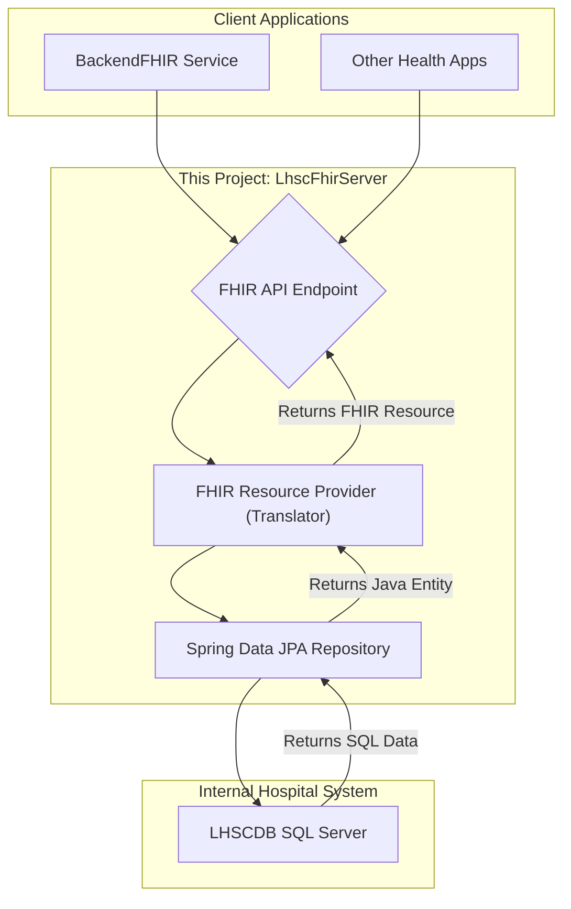

# LHSC FHIR Server: A Custom FHIR Facade

This repository contains the `LhscFhirServer`, a custom, enterprise-grade FHIR server built with Spring Boot and HAPI FHIR. This project represents a core component of the MasterEHR ecosystem, simulating a real-world hospital's modern interoperability layer.

---

## 🎯 Purpose & Architecture

The primary purpose of this application is to act as a **FHIR Facade** for the legacy `LHSCDB` SQL Server database. It exposes a standard, secure, and modern HL7 FHIR R4 API to the outside world, while internally translating those requests into queries against a traditional relational database.

This architecture allows an organization to:
1.  **Modernize without Replacement:** Expose modern API capabilities without costly or risky migrations of their core database systems.
2.  **Ensure Interoperability:** Speak the universal language of FHIR, allowing it to connect with provincial health exchanges and other healthcare partners.
3.  **Abstract Complexity:** Hide the complex, internal structure of the `LHSCDB` from all client applications.

### Communication Flow

Client applications (like our `BackendFHIR` service) will interact with this server using standard FHIR RESTful calls. This server will then translate those calls into SQL queries via JPA, retrieve the data, transform it into FHIR resources, and send it back.

---

## 🚀 Core Technologies

* **Framework**: Spring Boot 3.x
* **FHIR Library**: HAPI FHIR Server
* **Database Communication**: Spring Data JPA
* **Database Driver**: Microsoft SQL Server JDBC Driver
* **Language**: Java 21

---

## 📝 Development Plan

This project will be built according to the WBS outlined in the master project plan. The key steps are:

1.  **Project Initialization:** Set up the Maven project with all required dependencies (`hapi-fhir-server`, `spring-data-jpa`, `mssql-jdbc`).
2.  **Database Integration:**
    * Configure the `application.properties` to connect to the `LHSCDB` SQL Server.
    * Create a `@Entity` class (`PatientEntity.java`) to map to the `Patients` table.
    * Create a `JpaRepository` interface (`PatientRepository.java`) to handle database queries.
3.  **FHIR Provider Implementation:**
    * Create a `PatientProvider.java` that implements HAPI FHIR's `IResourceProvider`.
    * Implement the `@Read` method to fetch a patient by ID from the database and transform it into a FHIR `Patient` resource.
    * Implement the `@Search` method to query for patients based on criteria like family name.
    * Implement `@Create`, `@Update`, and `@Delete` methods to provide full CRUD functionality, translating incoming FHIR resources into database operations.
4.  **Deployment:**
    * Create a `Dockerfile` for the application.
    * Deploy the service to a cloud host like Render, configuring production database credentials as secure environment variables.
